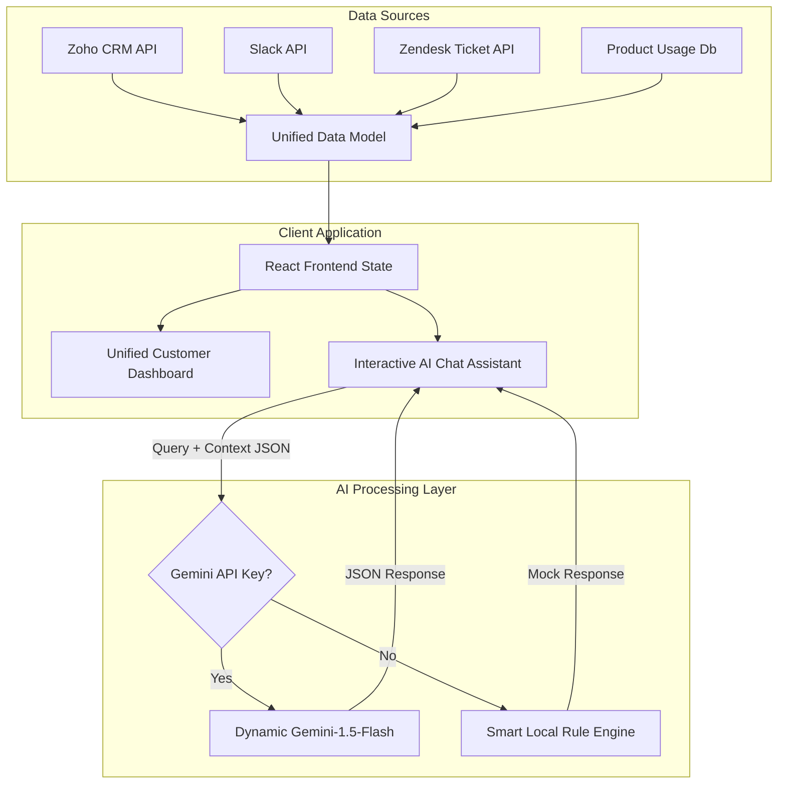

# Task 2: AI Customer View Tool-Building Challenge — Approach Document

## 1. Problem Statement
Growing businesses face the challenge of fragmented customer information. Data resides in silos: CRM details in Zoho, support tickets in Zendesk or Jira, customer conversations in emails, and internal discussions in Slack. Account Executives, Customer Success Managers (CSMs), and Growth teams waste hours toggling between platforms to gather context before a client call. This fragmentation leads to:
- Missed churn indicators (e.g., support ticket spikes coinciding with drops in product usage).
- Overlooked expansion opportunities (e.g., high license utilization accompanied by hiring signals in Slack).
- Slow response times and misaligned client communication.

---

## 2. Solution Approach
We have built **GrowthSync AI**, a unified client intelligence portal that aggregates multi-source data into a single, cohesive customer dashboard. It consolidates:
1. **Zoho CRM Profile**: Contract values, renewal dates, account owners, and operational notes.
2. **Product Usage Data**: WAU trends, license seats utilization rates, and feature activations.
3. **Integration Activity Feed**: Chronological stream of emails, Slack messages, and Zendesk support tickets.
4. **AI Summary Panel**: Contextual summaries, risk assessments, opportunities, and recommended Next Best Actions.
5. **Interactive Chat Assistant**: Allows teams to ask natural language questions about the customer's history.

The application operates in two modes:
- **Default/Mock Mode**: Uses rich, high-fidelity customer profiles out-of-the-box.
- **Dynamic API Mode**: When supplied with a Google Gemini API Key in the settings panel, it dynamically queries the live Gemini LLM to answer questions and analyze records in real-time.

---

## 3. Architecture & Workflow



### Data Synchronization Flow:
1. **Extraction**: System reads data from the CRM, communication channels, ticketing systems, and product database.
2. **Normalization**: The data is mapped to a standardized JSON schema containing company demographics, support logs, communications, and product performance.
3. **Synthesis**: The normalized payload is passed to the AI engine (Gemini) with instructions to summarize, flag risks, list expansion signals, and suggest next actions.
4. **Presentation**: The React UI renders a fast, responsive dark-mode portal displaying stats, timelines, usage charts, and an interactive assistant.

---

## 4. Tools & Technologies Used
* **Framework**: React 19 + Vite (built with SPA architecture for speed and zero-page-load transitions).
* **Styling**: Vanilla CSS with modern custom variables, glassmorphic panels (`backdrop-filter`), and CSS keyframe animations.
* **AI Model**: Google Gemini 1.5 Flash (via REST API).
* **Fonts**: Outfit (headings) & Plus Jakarta Sans (body UI) via Google Fonts.

### System Prompt for Dynamic AI Chat:
```text
You are a customer success AI assistant. You are analyzing customer support logs, CRM data, emails, and product metrics.
Below is the unified dataset for the customer named "[Customer Name]":
[JSON Data]

Answer the user's question about this customer. Be concise, direct, professional, and act on the actual data provided. Avoid marketing speak. Focus on risk signals, opportunities, and operational details.
```

---

## 5. Dummy Data Schema
We created three distinct customer scenarios representing typical lifecycle profiles:
1. **Acme Corp (At Risk)**: $75k ARR, renewing in 2 months. Drop in active users (140 to 60) coinciding with 504 API timeouts and Google Ad card clearance failure tickets. High risk of churn.
2. **BetaLabs (Good/Expansion)**: $24k ARR, 98% license utilization, onboarding 15 new hires next week. Prime upsell candidate.
3. **Apex Logistics (Neutral/Underutilized)**: $120k ARR, only 26% seat utilization. Solid relationship, but lagging product adoption.

---

## 6. Sample Input & Output

### Sample Input (Customer Dataset excerpt):
```json
{
  "id": "acme-corp",
  "name": "Acme Corp",
  "healthStatus": "At Risk",
  "contractValue": 75000,
  "renewalDate": "2026-09-10",
  "supportTickets": [
    { "id": "TICK-908", "category": "Technical / API", "title": "API latency spikes in EU-West production", "status": "Open" }
  ],
  "communications": [
    { "sender": "Arthur Pendelton (CFO)", "body": "If issues aren't resolved by next week, we will look at alternatives." }
  ]
}
```

### Sample Output (AI Context Synthesis):
* **AI Executive Summary**: "Acme Corp is at critical churn risk. They are experiencing severe API latency issues blocking ledger sync in Europe, alongside payment processing card declines. The CFO has explicitly threatened to cancel their contract (renewing in 2 months) if issues are not resolved by next week."
* **Next Best Action**: "Arrange an emergency call with Sarah Jenkins (CSM), the Volopay Technical Director, and Acme CFO Arthur Pendelton today. Waive the platform fee for the next billing cycle as a goodwill gesture while engineering deploys the API patch."

---

## 7. Future Improvement
**Implement Vector Embeddings and RAG (Retrieval-Augmented Generation) for Historical communications:**
In a real production environment, customer history spans years of emails, thousands of Slack messages, and massive log files. Sending the entire history in a single API prompt would exceed token limits and increase latency. 
Implementing a RAG pipeline would involve:
1. Chunking and generating vector embeddings (using `text-embedding-004`) for all emails, Slack chats, and ticket comments.
2. Storing these vectors in a database (like pgvector or Pinecone).
3. On user query, performing a semantic similarity search to retrieve only the top 10 most relevant historical snippets.
4. Feeding only those relevant snippets into Gemini, keeping response times under 1 second and minimizing token costs.
